# Opening up a successful restaurant in Vancouver 🍣

## Introduction

Question: **Where should someone set up a new restaurant in Vancouver? More importantly, what kind of restaurant should it be?** Vancouver is a city known for its delicious seafood, beautiful nature scenery, and laid back lifestyle. However, only knowing these factors are not enough for investors to seriously make it big in the Vancouver restaurant industry. Every year, many restaurants open in Vancouver only to suffer under its high turnover rate and unforgivable niche markets. As a business problem, we can use data to answer the question of the best location to open a particular restaurant in Vancouver. Vancouver, as an immigrant city, is home to many different kinds of food markets. Knowing where venues are located and analyzing similarities inside neighbourhoods will give investors the best chance to open up a successful restaurant on the west coast (best coast).

People who would be interested in this project include business owners or investors interested in getting a holistic view of the restaurant trends and patterns in the Vancouver Area. If anything, it should introduce people to the most general idea of where they should look to open up a restaurant.

Since we will be clustering Vancouver neighbourhoods and venues based on patterns in the data, it will reveal some interesting niches that exist within the city. As a local, I can also give some perspective on why these trends appear from knowledge outside the data. This data science approach can be applied to any other city as well. Please extend this report to other cities if you can!

## Data

Data was taken from the [Open Data Catalogue](https://vancouver.ca/your-government/open-data-catalogue.aspx) provided by the City of Vancouver. Initially, there was actually a lot of bulk introduced by the Census data which I cleaned up to only hold financial and quantative information. I did not want to introduce language into the mix because I knew Chinese and English would skew the data too intensely. Knowing this, I decided to only keep track of the neighbourhoods and corresponding financial information for my data. I plotted the locations of these neighbourhoods onto a map.

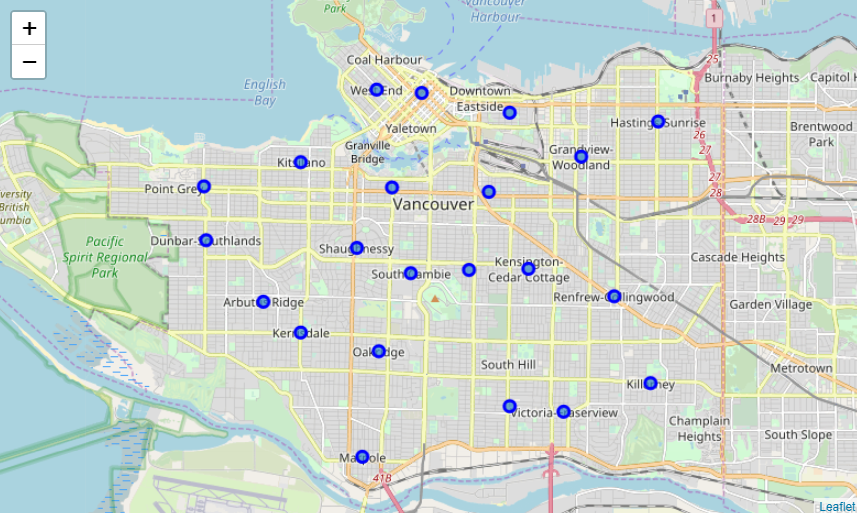

After grabbing the neighbourhoods and its financial data, I used the FourSquare API to grab venues around each of the 23 distinct neighbourhoods. Note, I did not include the neighbourhoods in the Greater Vancouver Area because I wanted to localize this project to the heart of the city. After grabbing the venues in each neighbourhood, I plotted my results onto a map.

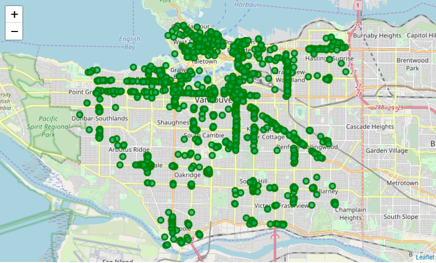

After pumping the neighbourhoods through the API and grabbing all these venues, I distinctly filtered out for each venue for its corresponding neighbourhood location, venue location, and venue category. I conceded that these values are the most important for data visualization and modelling. Intuitively, building a clustering algorithm based on location will cluster points that are close to one another on the 2D plane. In the back of my mind, I wanted to do this because then I could categorize each neighbourhood with its venues into a specific restaurant type. Luckily, after my modelling, it seemed like the data fortunately took on this direction. 

## Methodology

After grabbing the data, it was apparent that this was a clustering problem. From my knowledge, I had to decide between two algorithms: KMeans and DBScan. I defaulted to KMeans because of its speed and simplicity. DBScan does not work well over clusters with different densities, and this was apparent when I plotted all the different venues locations in Vancouver. The concentrations of venues in Vancouver depend heavily on geographical area which was not evenly spaced and led to skewed densities.

After choosing to use KMeans, I needed to choose an optimal K for the algorithm. I did some research and found that plotting the variances for different values of K could help. This was known as the elbow method and it revealed that K = 5 was the sweet spot before introducing more clusters would have diminishing returns. 

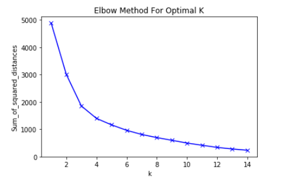

After prepping the data (one-hot encoding and such), I fed it through the KMeans model and discovered an interesting cluster of different neighbourhoods within the city and a perimeter cluster to follow. My intuition that location clustered the data into local neighbourhoods was correct, but I was very intrigued by the orange cluster "around" Vancouver. Most of the insights were actually discovered through graphs because it could rank the venue categories of each cluster clearly. However, the spatial coordinates that marked the four clusters within Vancouver and its perimeter reveal an interesting pattern in demographics which I will explain in the next section. Furthermore, the red circle indicators simply show the central point of each cluster. For clusters that are not densely packed, this centroid is less meaningful. Nevertheless, it can hint to the "hotspot" of each cluster.

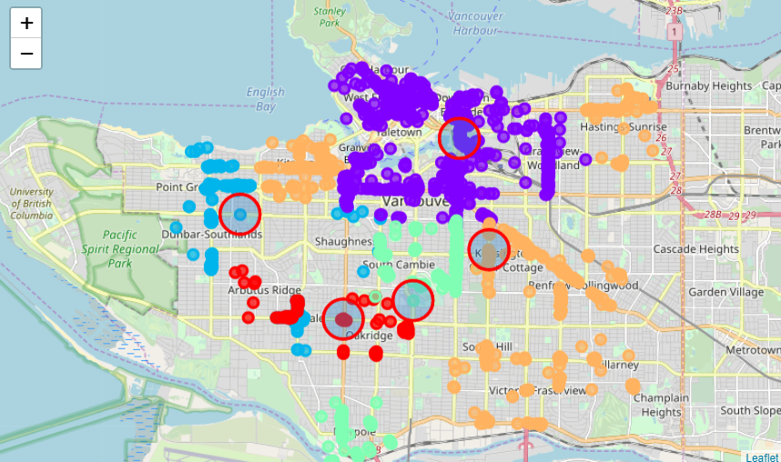

## Discussion

In general, the graphs revealed the most information of each cluster. Speaking of demographics, it is clear that Japanese restaurants are the most prevalent in Downtown Vancouver (Cluster 0) because the highest concentration of the Japanese population in Vancouver work there! The correlation makes sense. 

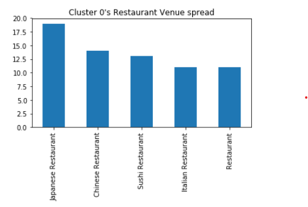
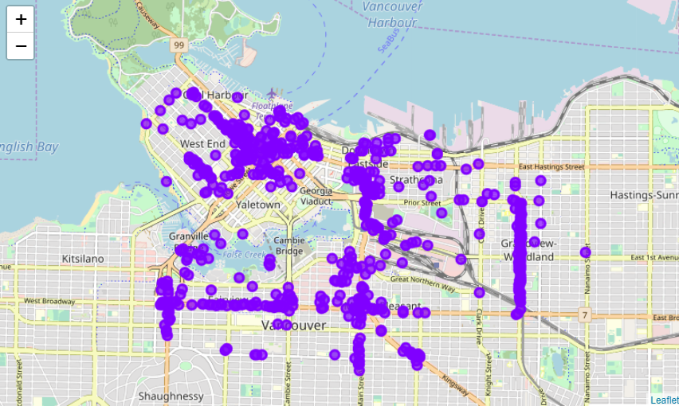

Simiarly, although there is a healthy number of Chinese people all around Vancouver, their densest populace is in Richmond (south of Vancouver). As we head towards the south (Cluster 2), the teal cluster reveals that Chinese Restarants are the most popular in its areas. 

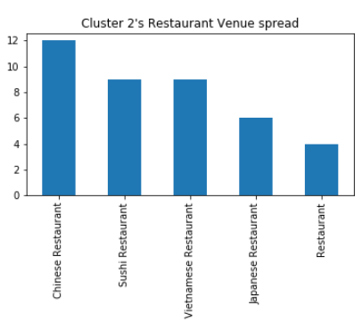
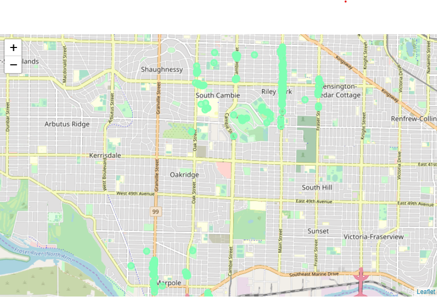

Cluster 4 and Cluster 1 are often transitory areas for students headed towards UBC which explains the prevalence of Sushi restaurants as a quick cheap food option. 

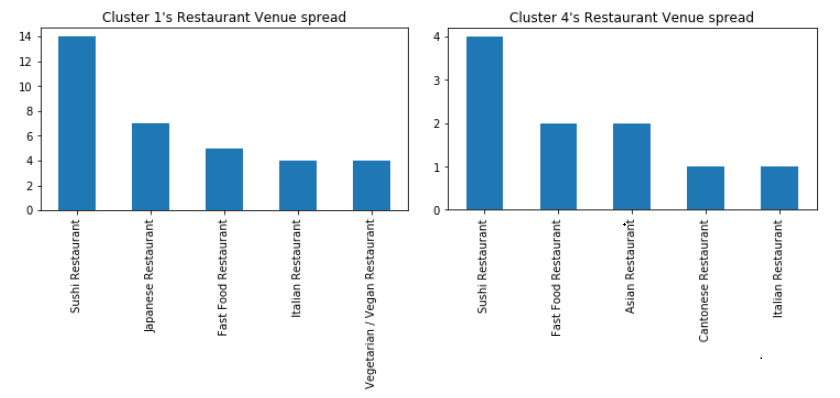
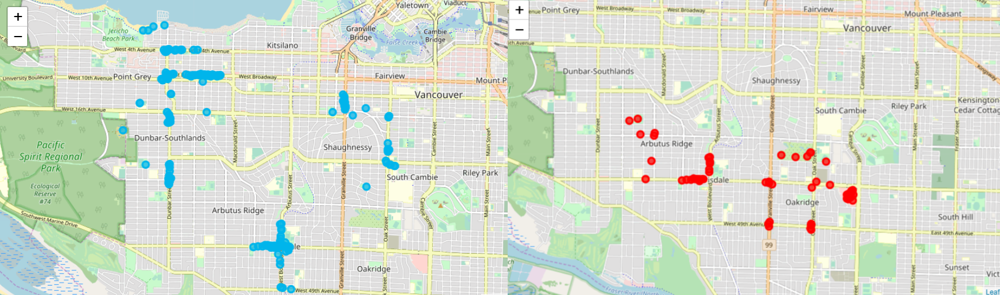

The surrounding orange cluster (Cluster 3) is filled with Vietnamese restaurants because most Vietnamese families have a lower household income and cannot afford to live in the heart of the city. This shows that income was an important proponant of determining that Vietnamese families work and live in the on the perimeter of the city!

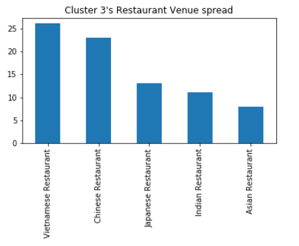
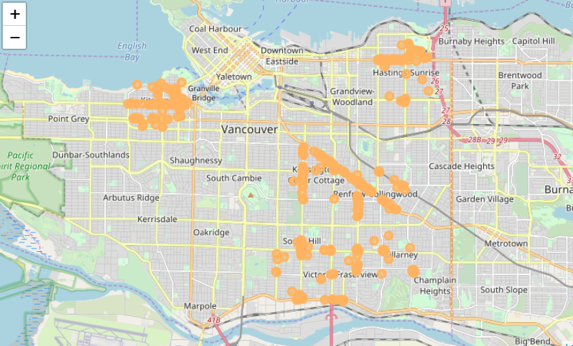

It is interesting to discover that the demographics of Vancouver match the model despite not being explicitly targeted as a field in our inputs. By only providing spatial and financial information, it shows that the data can still pull out patterns that bring important value.

## Conclusion

The clustering above reveal patterns that rely on the location, income, houseland size, and number/type/gender of people in each neighbourhood. It reveals that each cluster has its own restaurant specialization that best fits its demographic.  

Based on the results above, the type and location of a new restaurant in Vancouver should follow these rules:
* Cluster 0: If someone is interested in setting up a restaurant in **Downtown Vancouver**, they should consider a **Japanese Restaurant**. This is because Downtown Vancouver holds the densest Japanese population in Vancouver and is a hot tourist destination spot. It is known that tourists will pay a lot for Japanese Food in central Downtown Vancouver - check out [Miku](https://mikurestaurant.com)
! 🍜
* Cluster 1: If someone wants to set up a restaurant around **West Point Grey**, they should consider a **Sushi Restaurant**. This neighbourhood houses many university students that are willing to pay for a quick cheap meal in the area. 🍣 
* Cluster 2: Opening up a **Chinese restaurant** in **Riley Park and Marpole** is a good idea. This mature neighbourhood houses many sleightly above middle-class Chinese residents that will pay a pretty penny for a decent Chinese spot to frequent. 🥡
* Cluster 3: This is the largest spread of neighbourhoods/venues that surround Vancouver, but shows that **Vietnamese Restaurants** are commonplace around the perimenter of Vancouver. If a restaurant owner wants to invest into Vietnamese food, **Kitsilano or the surrounding areas of Vancouver** are promising. 🍲
* Cluster 4: **Oakridge** as a transit hub will be a great place to open up a **Sushi Restaurant**. Students or professionals on the run can grab a quick bite to eat before heading east or westward to their destinations. A sushi restaurant is always a good idea in these fast-paced transitory areas.🍱

I hope my first clustering analysis of restaurants in Vancouver was interesting and engaging. This was a very fun project to apply some of my data science knowledge into a real dataset offered by the city of Vancouver. Discovering patterns through data is beautiful. And if beauty can be found in the best location to open up a restaurant in Vancouver, please use this notebook for some added insight! 😊
